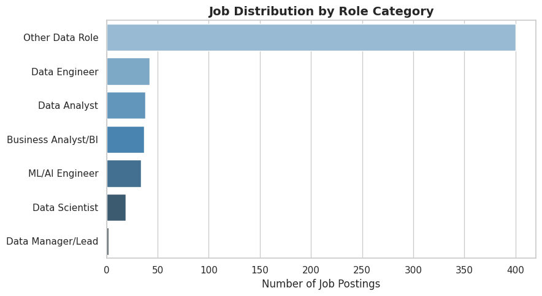
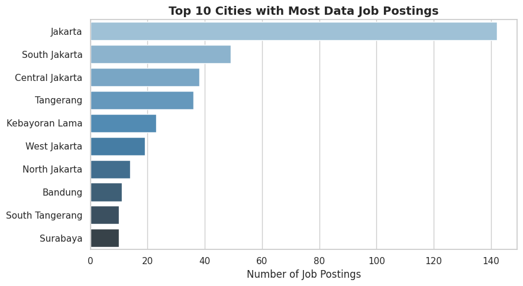
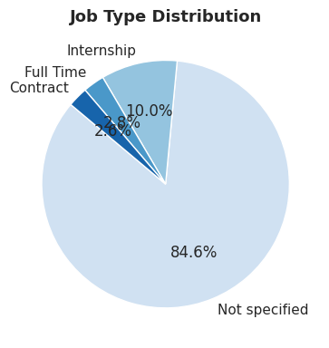
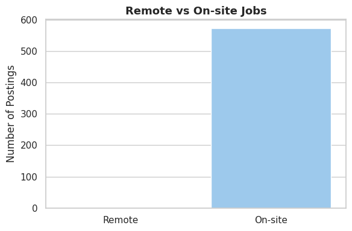
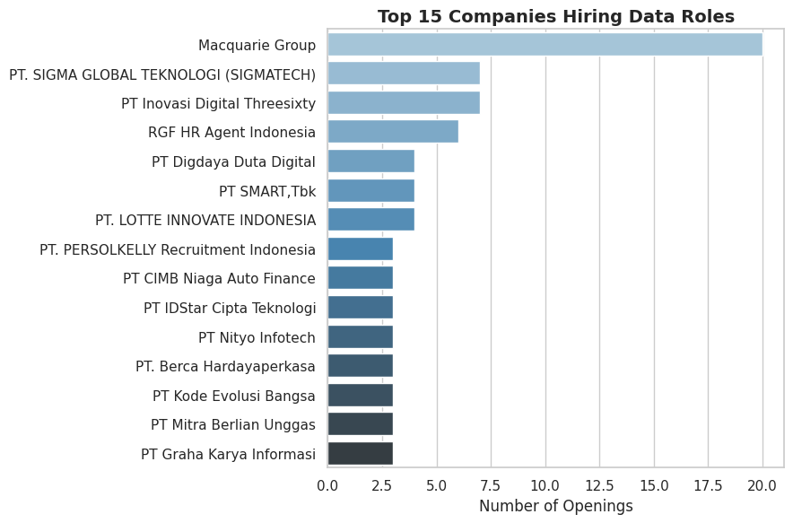
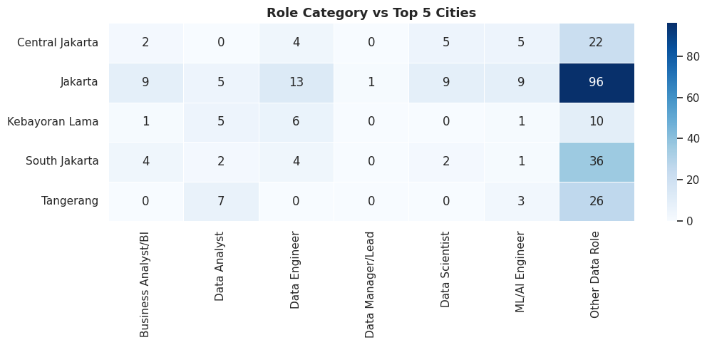
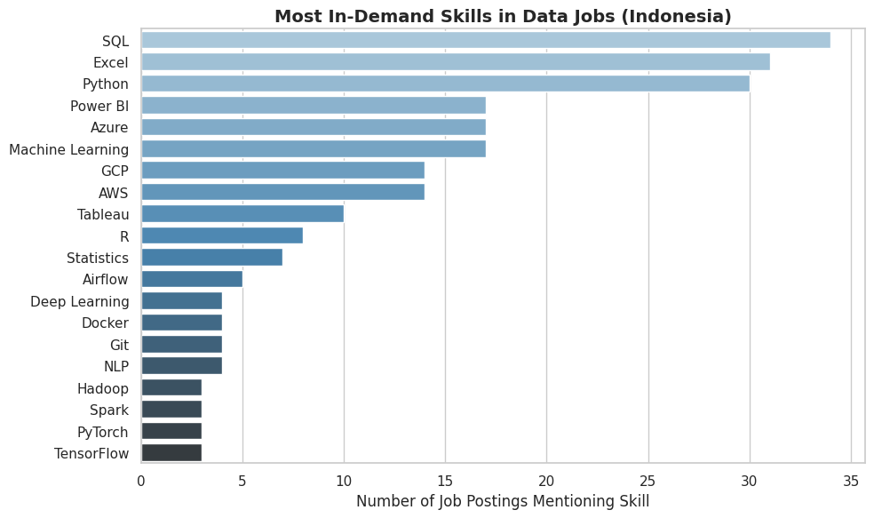
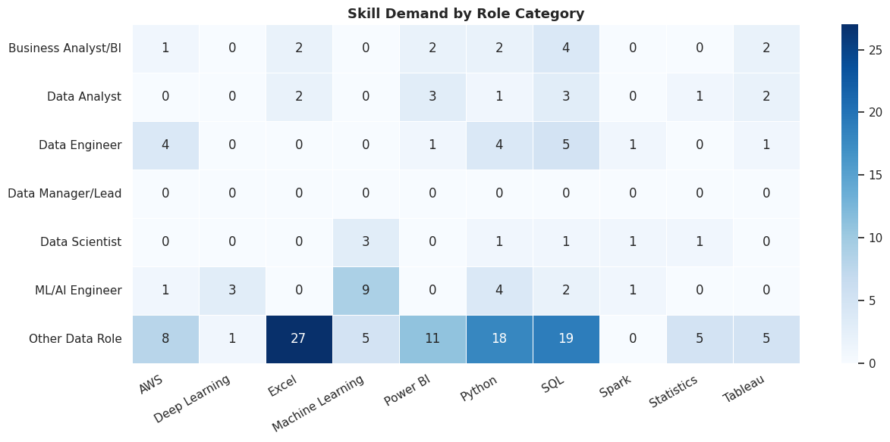
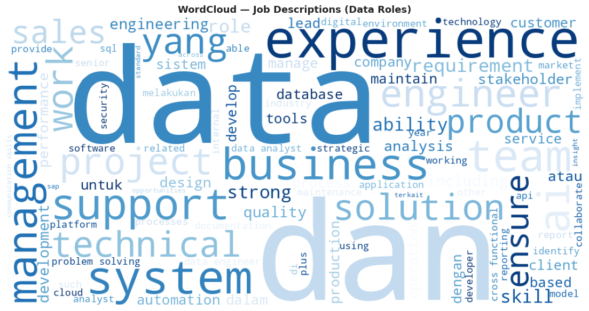

# 💼 Data Science Job Market Analysis — Indonesia


An end-to-end data project that **scrapes**, **stores**, **queries**, and **analyzes** the Data Science job market in Indonesia using Jobstreet as the data source — providing actionable insights for fresh graduates entering the data field.

---

## 📌 Project Overview

| Detail | Info |
|--------|------|
| Data Source | [Jobstreet Indonesia](https://id.jobstreet.com) |
| Scraping Method | Selenium + BeautifulSoup (full job detail pages) |
| Storage | SQLite (`job_market.db`) |
| Analysis | 7 SQL queries + Python EDA |
| Total Jobs Scraped | **572 jobs** |
| Keywords Scraped | Data Scientist, Data Analyst, Data Engineer, ML Engineer, Business Analyst, Data Science |

---

## 🎯 Business Questions Answered

1. What data roles are most in demand in Indonesia?
2. Which cities have the most job openings?
3. What skills are required most across all roles?
4. Which companies are hiring the most?
5. How many jobs offer remote work?
6. How transparent are companies about salary?
7. What skills are specific to each role category?

---

## 🗂️ Project Structure

```
job-market-analysis/
│
├── Job_Market_Analysis_Indonesia.ipynb  # Main notebook
├── job_market.db                        # SQLite database
├── jobs_raw_full.csv                    # Raw scraped data (with full descriptions)
├── jobs_cleaned.csv                     # Cleaned data
├── images/
│   ├── role_distribution.png
│   ├── top_cities.png
│   ├── job_type_distribution.png
│   ├── remote_vs_onsite.png
│   ├── top_companies.png
│   ├── city_role_heatmap.png
│   ├── skill_demand.png
│   ├── skill_by_role.png
│   └── wordcloud_jobs.png
└── README.md
```

---

## 🔄 Workflow

1. **Web Scraping** — Selenium renders JS pages, BeautifulSoup parses HTML job cards + visits each job detail page for full description
2. **Data Cleaning** — Deduplicate, extract & normalize city names, categorize roles, infer job type, flag remote
3. **SQLite Storage** — Store structured data into local database
4. **SQL Analysis** — 7 business queries to extract insights
5. **EDA** — 6 visualization charts
6. **Skill Analysis** — Regex-based extraction from full job descriptions
7. **Conclusion** — Key findings and recommendations

---

## 🕷️ Scraping Approach

### Target Site
`https://id.jobstreet.com/{keyword}-jobs?page={n}&sortmode=ListedDate`

### Two-Stage Scraping

| Stage | What | Why |
|-------|------|-----|
| Stage 1 | Scrape job listing pages | Get title, company, location, URL |
| Stage 2 | Visit each job detail page | Get **full description** (300–1000 words) for skill detection |

> ⚠️ Stage 2 is what makes skill detection accurate. Listing pages only show a 1-2 sentence snippet — not enough to detect skills.

### Data Fields Extracted

| Field | Source |
|-------|--------|
| Job Title | Job card — `a[data-automation='jobTitle']` |
| Company | Job card — `a[data-automation='jobCompany']` |
| Location | Job card — `span[data-automation='jobCardLocation']` |
| Salary | Job card — `span[data-automation='jobSalary']` |
| Job Type | Job card — `span[data-automation='jobWorkType']` |
| Date Listed | Job card — `span[data-automation='jobListingDate']` |
| Full Description | Detail page — `[data-automation='jobAdDetails']` |

---

## 🗄️ SQL Analysis

### 7 Key Queries

**Q1 — Jobs per Role Category**
```sql
SELECT role_category, COUNT(*) AS total_jobs
FROM jobs
GROUP BY role_category
ORDER BY total_jobs DESC
```

**Q2 — Top 10 Cities**
```sql
SELECT city, COUNT(*) AS total_jobs
FROM jobs
WHERE city != 'Unknown'
GROUP BY city
ORDER BY total_jobs DESC
LIMIT 10
```

**Q3 — Job Type Distribution**
```sql
SELECT job_type, COUNT(*) AS total
FROM jobs
GROUP BY job_type
ORDER BY total DESC
```

**Q4 — Top 15 Companies Hiring**
```sql
SELECT company, COUNT(*) AS total_openings
FROM jobs
WHERE company IS NOT NULL
  AND company != 'Private Advertiser'
GROUP BY company
ORDER BY total_openings DESC
LIMIT 15
```

**Q5 — Remote vs On-site**
```sql
SELECT CASE WHEN is_remote = 1 THEN 'Remote' ELSE 'On-site' END AS work_type,
       COUNT(*) AS total
FROM jobs GROUP BY is_remote
```

**Q6 — Role Breakdown per Top 5 Cities**
```sql
SELECT city, role_category, COUNT(*) AS total
FROM jobs
WHERE city IN (SELECT city FROM jobs GROUP BY city ORDER BY COUNT(*) DESC LIMIT 5)
GROUP BY city, role_category
ORDER BY city, total DESC
```

**Q7 — Salary Transparency**
```sql
SELECT CASE WHEN salary IS NOT NULL AND salary != ''
            THEN 'Salary Listed' ELSE 'Salary Not Listed' END AS salary_status,
       COUNT(*) AS total,
       ROUND(COUNT(*) * 100.0 / (SELECT COUNT(*) FROM jobs), 1) AS percentage
FROM jobs GROUP BY salary_status
```

---

## 📊 EDA Visualizations

### Job Distribution by Role Category
> "Other Data Role" dominates (400 jobs) as many titles don't match standard data role keywords.  
> Among categorized roles: **Data Engineer (42) > Data Analyst (38) > Business Analyst/BI (35) > ML/AI Engineer (34) > Data Scientist (19)**.



---

### Top 10 Cities
> **Jakarta** leads with 140 job postings — nearly 3x the second city (South Jakarta: 50).  
> Jakarta + South Jakarta + Central Jakarta combined = ~40% of all listings.  
> Tangerang (35) and Kebayoran Lama (23) round out the top 5.



---

### Job Type Distribution
> **84.6% of job postings do not specify job type** — Jobstreet often omits this from listing cards.  
> Among those specified: Internship (10%), Contract (2.8%), Full Time (2.6%).



---

### Remote vs On-site
> **100% of scraped jobs are On-site** — no remote data roles detected in Indonesia on Jobstreet.  
> Remote data work remains nearly non-existent in Indonesia's formal job market.



---

### Top 15 Companies Hiring
> **Macquarie Group** leads with 20 openings — a global financial services firm with strong data infrastructure needs.  
> Most other top companies are Indonesian IT consultancies and recruitment agencies, reflecting outsourced data hiring.



---

### Role Category × City Heatmap
> Jakarta dominates across all roles, especially Other Data Role (96) and Data Engineer (13).  
> Tangerang has a high concentration of Data Analysts (7) relative to its size.  
> Kebayoran Lama shows notable Data Engineer demand (6).



---

## 🏆 Skill Demand Analysis

> Skills extracted via regex from **full job descriptions** (572 jobs × avg 300+ words).



### Top 10 Most In-Demand Skills

| Rank | Skill | Count | Notes |
|------|-------|-------|-------|
| 1 | **SQL** | 34 | Universal across all data roles |
| 2 | **Excel** | 31 | Strong demand especially in BA/BI roles |
| 3 | **Python** | 30 | Core DS/DE/ML skill |
| 4 | **Power BI** | 17 | High demand in analyst roles |
| 5 | **Azure** | 17 | Cloud platform — tied with Power BI |
| 6 | **Machine Learning** | 17 | Concentrated in ML/AI Engineer roles |
| 7 | **GCP** | 14 | Google Cloud strong in DE roles |
| 8 | **AWS** | 14 | Cloud infrastructure skill |
| 9 | **Tableau** | 10 | Visualization tool for analysts |
| 10 | **R** | 8 | Statistical analysis |

---

### Skill Demand by Role Category



| Role | Top Skills |
|------|-----------|
| **Data Engineer** | AWS (4), Python (4), SQL (5) |
| **Data Analyst** | Power BI (3), SQL (3), Tableau (2) |
| **Data Scientist** | Machine Learning (3), Python (1), Spark (1) |
| **ML/AI Engineer** | Machine Learning (9), Deep Learning (3), AWS (1) |
| **Business Analyst/BI** | SQL (4), Power BI (2), Excel (2) |
| **Other Data Role** | Excel (27), SQL (19), Python (18) |

---

### WordCloud — Job Descriptions

> Most prominent terms: **experience, data, business, management, support, system, engineer, analyst, solution, technical** — reflecting the broad scope of data roles in Indonesia.



---

## 💡 Key Findings & Recommendations

| Finding | Recommendation for Job Seekers |
|---------|-------------------------------|
| SQL is the #1 most demanded skill (34 mentions) | 💻 Master SQL first — it's non-negotiable across all roles |
| Python and Excel both rank top 3 | 📊 Learn Python for DS/DE, Excel for BA/Analyst roles |
| Jakarta has 3x more jobs than any other city | 🗺️ Target Jakarta for maximum opportunities |
| 0% remote jobs available | 🏢 Be prepared for full on-site work |
| 74.5% of jobs don't list salary | 💰 Use Glassdoor/LinkedIn Salary for benchmarking |
| Data Analyst is the most accessible entry role | 🎯 Strong starting point for fresh graduates |
| ML/AI roles need Machine Learning (9) as top skill | 🤖 Specialize in ML frameworks for AI engineer track |
| Macquarie Group is the top single hirer | 🏦 Finance sector actively hiring data talent |

---

## 📈 Summary Statistics

| Metric | Value |
|--------|-------|
| Total Jobs Scraped | 572 |
| Most In-Demand Role | Other Data Role (400) / Data Engineer (42) |
| Top Hiring City | Jakarta (140 jobs) |
| Most Required Skill | SQL (34 job postings) |
| Top Hiring Company | Macquarie Group (20 openings) |
| Remote Jobs | 0% |
| Jobs with Salary Info | 25.5% |

---

## 🛠️ Tech Stack

| Tool | Purpose |
|------|---------|
| `Selenium` | Render JavaScript-heavy pages + navigate job detail pages |
| `BeautifulSoup` | Parse HTML and extract structured data |
| `webdriver-manager` | Auto-manage ChromeDriver version matching |
| `SQLite3` | Store and query structured job data |
| `pandas`, `numpy` | Data manipulation and cleaning |
| `matplotlib`, `seaborn` | Charts and heatmaps |
| `wordcloud` | Job description text visualization |

---

## 🚀 How to Run

1. **Clone the repository**
   ```bash
   git clone https://github.com/adin-alxndr/data-job-market-indonesia
   cd data-job-market-indonesia
   ```

2. **Install dependencies**
   ```bash
   pip install selenium webdriver-manager beautifulsoup4 lxml pandas numpy matplotlib seaborn wordcloud
   ```

3. **Run on Google Colab (recommended)**

   [](https://colab.research.google.com/)

   > Chrome is automatically installed on Colab — no manual setup needed.

4. **Run locally**
   ```bash
   jupyter notebook "job_market_analysis.ipynb"
   ```
   > Requires Google Chrome installed on your machine.

---

## ⚠️ Notes

- Scraping uses **polite delays** (`time.sleep(2)`) between requests
- Full description scraping takes ~20 minutes for 570 jobs — results cached in `jobs_raw_full.csv`
- If Jobstreet changes their HTML structure, update CSS selectors in `parse_jobs()` and `fetch_full_description()`
- Data freshness: results reflect the exact date the script is run

---

## 📄 License

This project is open-source and available under the [MIT License](LICENSE).

---

## 🙋 Author

Made by [adin-alxndr](https://github.com/adin-alxndr/)
